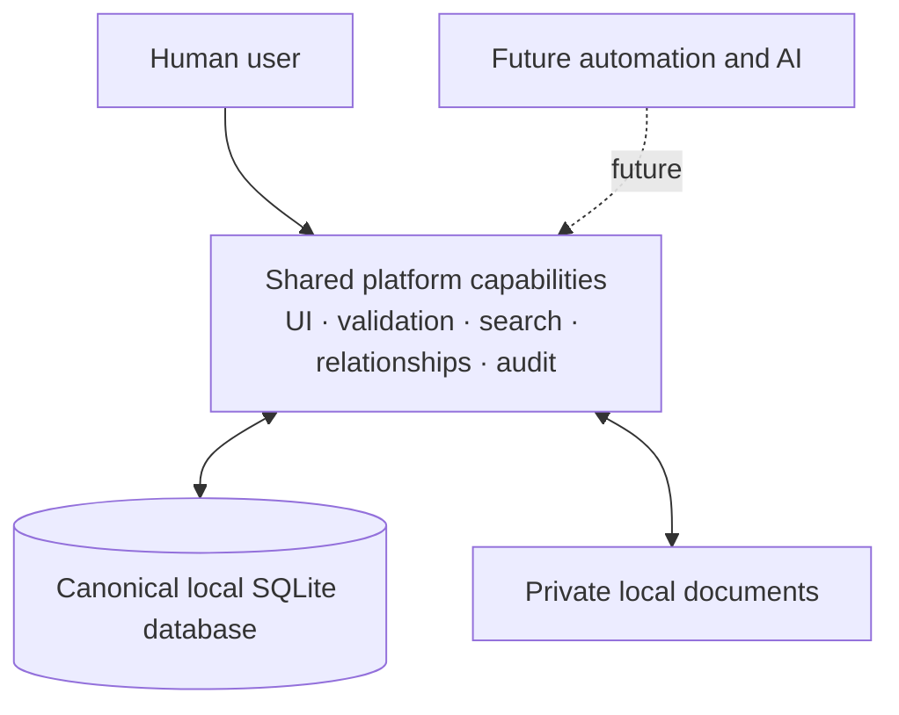

# Project E

> A local-first Personal Information Platform for turning private, connected information into a useful operational foundation.

Project E keeps meaningful information about people, organisations, locations, projects, documents and assets in one relationship-rich system. Its embedded SQLite database is the canonical source of truth; the interface, deterministic tools and future intelligent capabilities are all views and operations over that same platform.

The immediate aim is deliberately human: make the platform genuinely useful, trustworthy and pleasant for a private user. Automation and AI are important later capabilities, but they build on the information model, validation, provenance and user control—they are not the foundation.

## Current status

Project E is in the **Information Platform** phase. The local application already provides canonical entity and relationship records, search and structured filters, maps, document storage, journals, timelines, taxonomies, audit history, data-quality tools, duplicate merging, soft deletion and reviewed deterministic relationship inference.

The current product is designed for one private user and requires no account. Core records and workflows remain usable without WAN access; optional map tiles and address lookup may use replaceable network services. Import/export and continued usability and data-quality work are the next practical priorities.

## Architecture at a glance



Human users, deterministic automation and future AI should consume the same validated platform capabilities. No future layer should create a competing source of truth.

## Philosophy

- **Local-first and private:** useful without a cloud service or continuous connection.
- **Entity- and relationship-first:** model real things once, then provide multiple views over them.
- **Database-backed truth:** derived views and intelligent assistance remain traceable to canonical records.
- **Human usefulness before intelligence:** earn value through strong everyday workflows before adding advanced AI.
- **Safe evolution:** validation, audit history, provenance and explicit confirmation precede machine-written changes.
- **Simple, maintainable foundations:** prefer standard-library Python, SQLite and conservative dependencies.

See the [project goal](PROJECT_GOAL.md), [phased roadmap](ROADMAP.md) and [future platform direction](docs/future_direction.md) for the durable direction.

## Documentation

| Document | Purpose |
| --- | --- |
| [Project goal](PROJECT_GOAL.md) | Product purpose and durable principles |
| [Roadmap](ROADMAP.md) | Guidance from information platform to AI/agent platform |
| [Future direction](docs/future_direction.md) | Long-term capability model and Odysseus relationship |
| [Stage 1 specification](docs/stage_1_spec.md) | Current scope, behavior and acceptance criteria |
| [Architecture](docs/architecture.md) | Current application structure and boundaries |
| [Database design](docs/database_design.md) | Persistence, canonical data and migration rules |
| [Ontology](docs/ontology.md) | Entity and relationship semantics |
| [UI principles](docs/ui_principles.md) | Interaction and presentation conventions |
| [Architecture decisions](ARCHITECTURE_DECISIONS.md) | Durable decisions and consequences |
| [Glossary](docs/glossary.md) | Canonical terminology |
| [Technical debt](docs/reviews/technical_debt_register.md) | Unresolved actionable engineering debt |
| [Build history](docs/build_log.md) | Concise record of completed work |

Contributor and agent workflow guidance lives in [AGENTS.md](AGENTS.md).

Community participation is covered by the [contributing guide](CONTRIBUTING.md). Bug reports and focused feature proposals can be opened with the repository's issue templates.

## Run locally

Project E currently needs Python 3 and no third-party Python packages.

```bash
python3 run.py
```

Open `http://127.0.0.1:8000`. A fresh clone starts empty; the app creates its Git-ignored database and document storage under `instance/`.

```bash
python3 -m unittest discover -s tests
python3 -m compileall app run.py tests
```

## Screenshots

Screenshots will be added as the current interface settles. Until then, the architecture and Stage 1 specification provide the clearest tour of the platform without committing stale UI imagery.

Private databases, uploaded documents, logs, caches, exports and backups must never be committed.
