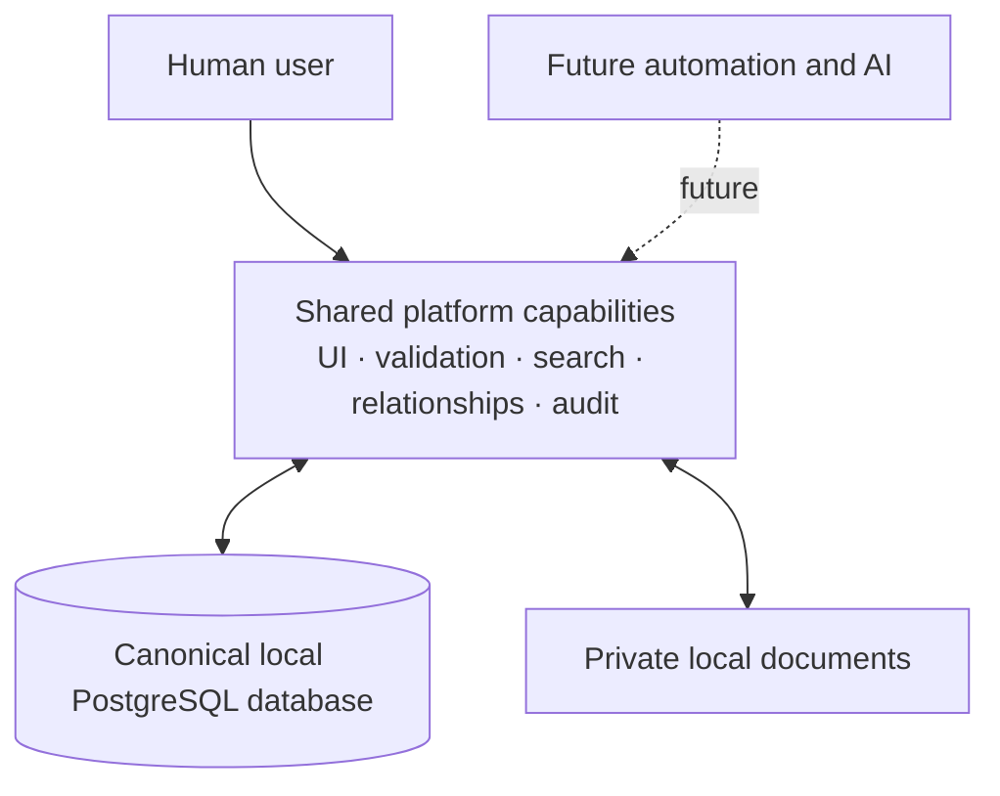

# Project E

> A local-first Personal Information Platform for turning private, connected information into a useful operational foundation.

Project E keeps meaningful information about people, organisations, locations, projects, documents and assets in one relationship-rich system. Its locally hosted PostgreSQL database is the canonical source of truth; it remains private, loopback-only and independent of cloud infrastructure.

The immediate aim is deliberately human: make the platform genuinely useful, trustworthy and pleasant for a private user. Automation and AI are important later capabilities, but they build on the information model, validation, provenance and user control—they are not the foundation.

## Current status

Project E is in the **Platform Maturity / Pre-Operational Intelligence** stage. The foundational Information Platform is largely established, and current work is closing its remaining lifecycle, portability and real-workflow gaps before the primary focus moves to Operational Intelligence. The local application already provides canonical entity and relationship records, search and structured filters, maps, document storage, journals, timelines, taxonomies, audit history, data-quality tools, duplicate merging, soft deletion and reviewed deterministic relationship inference.

The current product is designed for one private user and requires no account. Core records and workflows remain usable without WAN access; optional map tiles and address lookup may use replaceable network services. Versioned import/export, recovery backups and explicit recycled-relationship lifecycle policy are implemented; representative workflow review and maintainer confirmation remain the immediate Phase 1 exit work.

## Architecture at a glance



Human users, deterministic automation and future AI should consume the same validated platform capabilities. No future layer should create a competing source of truth.

## Philosophy

- **Local-first and private:** useful without a cloud service or continuous connection.
- **Entity- and relationship-first:** model real things once, then provide multiple views over them.
- **Database-backed truth:** derived views and intelligent assistance remain traceable to canonical records.
- **Human usefulness before intelligence:** earn value through strong everyday workflows before adding advanced AI.
- **Safe evolution:** validation, audit history, provenance and explicit confirmation precede machine-written changes.
- **Simple, maintainable foundations:** prefer raw SQL, a small PostgreSQL boundary and conservative dependencies.
- **Clean evolution while unstable:** during active development, prefer a coherent current architecture over compatibility layers for obsolete models; migrations are useful, and a local database reset remains acceptable.

See the [project goal](PROJECT_GOAL.md), [phased roadmap](ROADMAP.md) and [future platform direction](docs/future_direction.md) for the durable direction.

## Documentation

| Document | Purpose |
| --- | --- |
| [Project goal](PROJECT_GOAL.md) | Product purpose and durable principles |
| [Roadmap](ROADMAP.md) | Guidance from information platform to AI/agent platform |
| [Future direction](docs/future_direction.md) | Long-term capability model and Odysseus relationship |
| [Stage 1 specification](docs/stage_1_spec.md) | Current scope, behavior and acceptance criteria |
| [Architecture](docs/architecture.md) | Current application structure and boundaries |
| [Database design](docs/database_design.md) | Persistence, canonical data and migration rules |
| [Ontology](docs/ontology.md) | Entity and relationship semantics |
| [UI principles](docs/ui_principles.md) | Interaction and presentation conventions |
| [Architecture decisions](ARCHITECTURE_DECISIONS.md) | Durable decisions and consequences |
| [Glossary](docs/glossary.md) | Canonical terminology |
| [Phase 1 exit review](docs/reviews/phase_1_exit_review.md) | Verification evidence awaiting maintainer confirmation |
| [Technical debt](docs/reviews/technical_debt_register.md) | Unresolved actionable engineering debt |
| [Build history](docs/build_log.md) | Concise record of completed work |

Contributor and agent workflow guidance lives in [AGENTS.md](AGENTS.md).

Community participation is covered by the [contributing guide](CONTRIBUTING.md). Bug reports and focused feature proposals can be opened with the repository's issue templates.

## Security and copyright

Report suspected vulnerabilities privately by following the [security policy](SECURITY.md). Do not include personal or sensitive runtime data in public issues.

Project E is currently source-available but not open source. Copyright is retained by yogurtreceptor and no licence for reuse or redistribution is granted; see the [copyright notice](COPYRIGHT.md). This can be replaced with an explicit software licence later.

## Run locally

Project E needs Python 3, PostgreSQL 16 or later, and the dependency in `requirements.txt`.

```bash
python3 -m venv .venv
.venv/bin/pip install -r requirements.txt
.venv/bin/python tools/dev.py
```

Open `http://127.0.0.1:8000`. This manages a private loopback-only PostgreSQL cluster under `instance/postgres/`, applies migrations, starts the app, and stops both on Ctrl+C.

```bash
python3 -m unittest discover -s tests
python3 -m compileall app run.py tests
```

## Screenshots

Screenshots will be added as the current interface settles. Until then, the architecture and Stage 1 specification provide the clearest tour of the platform without committing stale UI imagery.

## Portable export and recovery

System Tools → Import and Export downloads a versioned, checksummed Project E Bundle containing a PostgreSQL-native snapshot and referenced document files. PostgreSQL remains an internal detail: import still validates and previews the bundle, requires an empty target and explicit confirmation, and creates a recovery bundle first.

Recovery is preview-only unless explicitly confirmed:

```bash
python3 tools/restore_backup.py instance/backups/<bundle>.zip
python3 tools/restore_backup.py instance/backups/<bundle>.zip --confirm-replace
```

Private databases, uploaded documents, logs, caches, exports and backups must never be committed.
