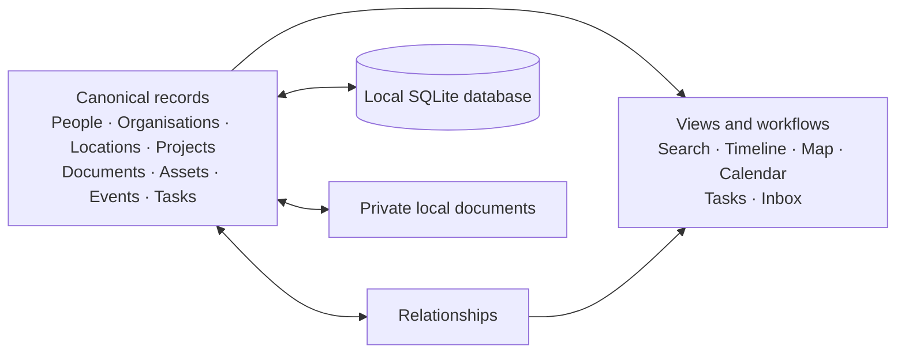

# Project E

> A local-first Personal Information Platform for turning private, connected information into a useful operational foundation.

Project E brings People, Organisations, Locations, Projects, Documents, Assets, Events and Tasks into one relationship-rich system. Its embedded SQLite database is the canonical source of truth, with private documents stored locally alongside it. Search, maps, timelines, Calendar, Tasks and Inbox are views and workflows over the same records—not competing data stores.

The immediate aim is deliberately human: make the platform useful, trustworthy and pleasant for one private user. Automation and AI are later capabilities built on validation, provenance and user control; they are not the foundation.

## Current product

| Status | Capability |
| --- | --- |
| **Available now** | Canonical records and relationships; search and structured filters; maps; document storage; journals and timelines; taxonomies; audit history; data-quality tools; duplicate merging; soft deletion; reviewed family inference; Calendar and recurring Events; Tasks and Calendar/Project projections; reminder policies and a durable local Inbox; portable export, import and recovery. |
| **In progress** | Scheduler-driven reminder delivery, startup recovery and the later deterministic-automation runtime in Phase 2. |
| **Not current scope** | AI, user accounts, cloud-dependent core operation, and external email, SMS, push or operating-system notification channels. |

Phase 1 — Information Platform is complete as a development milestone. Phase 2 is in progress: Calendar/Event and Task foundations are complete, while the operational runtime remains staged. The product requires no account. Core records and workflows work without WAN access; optional map tiles and address lookup use replaceable network services. See the [Phase 2 plan](docs/phase_2_plan.md).

## Product map


```mermaid
flowchart LR
    R["Canonical records<br/>People · Organisations · Locations · Projects<br/>Documents · Assets · Events · Tasks"]
    G["Relationships"]
    V["Views and workflows<br/>Search · Timeline · Map · Calendar<br/>Tasks · Inbox"]
    D[("Local SQLite database")]
    F["Private local documents"]

    R <--> G
    R --> V
    G --> V
    R <--> D
    R <--> F
```

Every view remains traceable to canonical local records. Optional map resources may use the network, but they are not required for core operation.

## Principles

- **Local-first and private:** useful without a cloud service or continuous connection.
- **Entity- and relationship-first:** model each real thing once, then provide multiple views over it.
- **Human usefulness before intelligence:** earn value through dependable everyday workflows before adding advanced assistance.
- **Safe evolution:** validation, audit history, provenance and explicit confirmation precede consequential machine-written changes.
- **Simple, maintainable foundations:** prefer standard-library Python, SQLite and conservative dependencies.
- **Coherent active development:** prefer a clean current architecture over obsolete compatibility layers while the product remains unstable.

For the durable direction, see the [project goal](PROJECT_GOAL.md), [roadmap](ROADMAP.md) and [future platform direction](docs/future_direction.md).

## Documentation

### Product and planning

- [Project goal](PROJECT_GOAL.md) — product purpose and durable principles
- [Phase 1 specification](docs/phase_1_spec.md) — delivered Information Platform behaviour and acceptance criteria
- [Phase 2 plan](docs/phase_2_plan.md) — operational time and deterministic-automation foundation
- [Roadmap](ROADMAP.md) and [future direction](docs/future_direction.md) — phased and longer-term direction
- [Build history](docs/build_log.md) and [Phase 1 closure review](docs/reviews/phase_1_exit_review.md) — completed-work context

### Technical reference

- [Architecture](docs/architecture.md), [database design](docs/database_design.md) and [ontology](docs/ontology.md)
- [Architecture decisions](ARCHITECTURE_DECISIONS.md), [glossary](docs/glossary.md) and [technical debt](docs/reviews/technical_debt_register.md)

### Experience and design

- [Experience philosophy](docs/experience_philosophy.md), [design documentation](docs/design/README.md) and [UI principles](docs/ui_principles.md)

### Contribute and report safely

- [Contributor and agent workflow](AGENTS.md) and [contributing guide](CONTRIBUTING.md)
- [Security policy](SECURITY.md) and [copyright notice](COPYRIGHT.md)

Project E is currently source-available, not open source. Copyright is retained by yogurtreceptor and no licence for reuse or redistribution is granted.

## Run locally

Project E needs Python 3 and no third-party Python packages.

```bash
python3 run.py
```

Open `http://127.0.0.1:8000`. A fresh clone starts empty and creates its Git-ignored SQLite database, document storage and recovery directories beneath `instance/`.

```bash
python3 -m unittest discover -s tests
python3 -m compileall app run.py tests
```

## Screenshot gallery

### Home

Project E Home, showing the persistent navigation shell and information entry points.


### Further screenshots

Calendar, Tasks, Inbox, Relationships and Map are implemented. Add representative, fictional screenshots of these workflows as they receive visual refreshes.

### Add a screenshot

Use this paste-ready pattern for a GitHub-hosted attachment. Replace all three placeholders; it deliberately renders no empty image while a slot is awaiting a screenshot.

```html


*{CAPTION}*
```

GitHub attachments are suitable for this gallery. Use fictional, scrubbed names, addresses, document filenames, dates and map coordinates; keep the original files locally; and refresh a screenshot when the workflow it depicts materially changes. If the gallery later needs repository-controlled URLs or release-stable images, move reviewed fictional assets into committed documentation assets.

## Portable export and recovery

System Tools → Import and Export downloads a versioned, checksummed ZIP containing a consistent SQLite snapshot and referenced document files. Import validates and previews a bundle, requires an empty target, requires explicit confirmation and creates a recovery backup first. Confirmed merges and permanent entity deletion also create recovery bundles under the Git-ignored `instance/backups/` directory.

Recovery is preview-only unless explicitly confirmed:

```bash
python3 tools/restore_backup.py instance/backups/<bundle>.zip
python3 tools/restore_backup.py instance/backups/<bundle>.zip --confirm-replace
```

Private databases, uploaded documents, logs, caches, exports and backups must never be committed.
