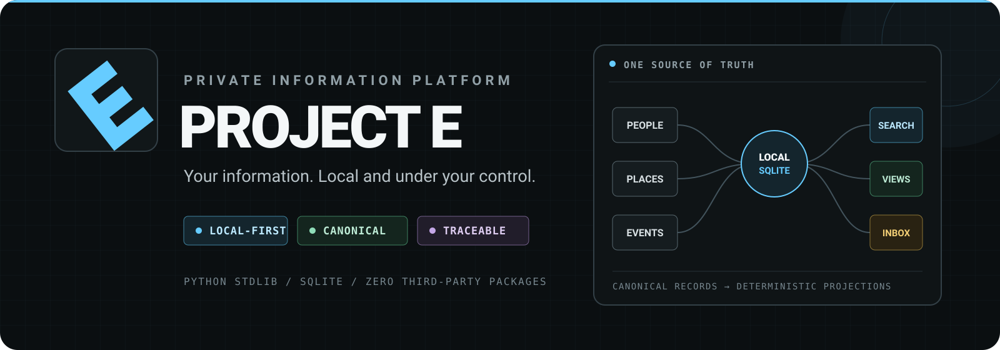
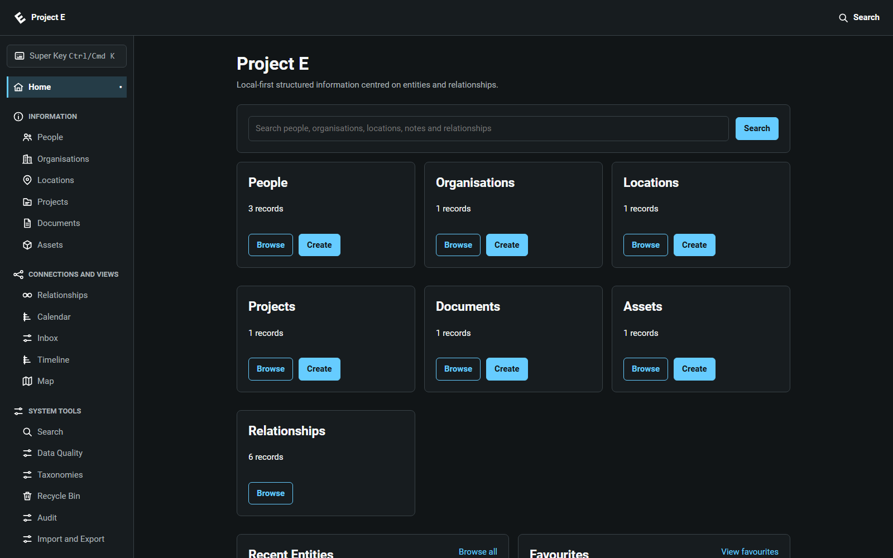
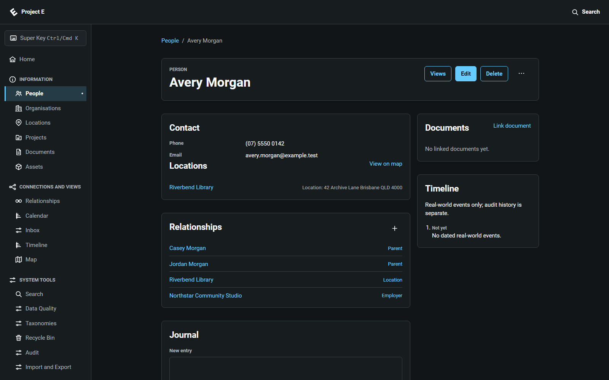
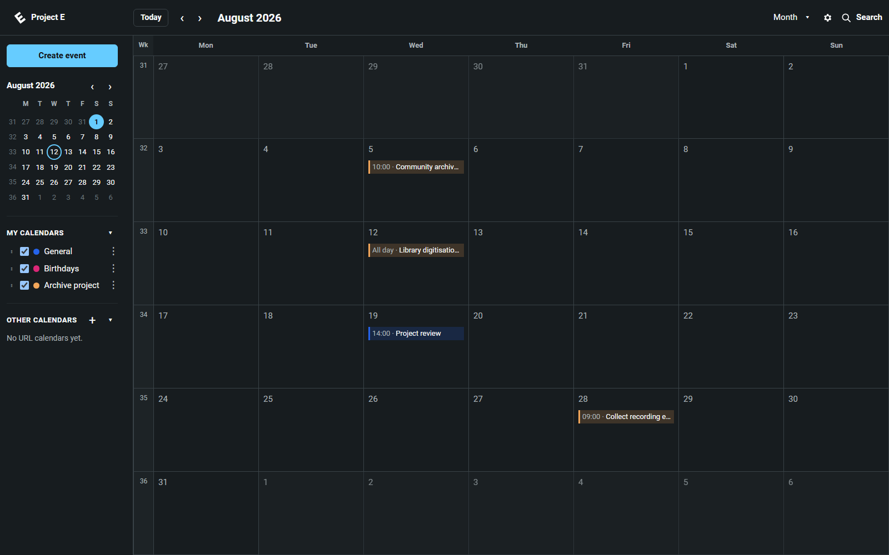
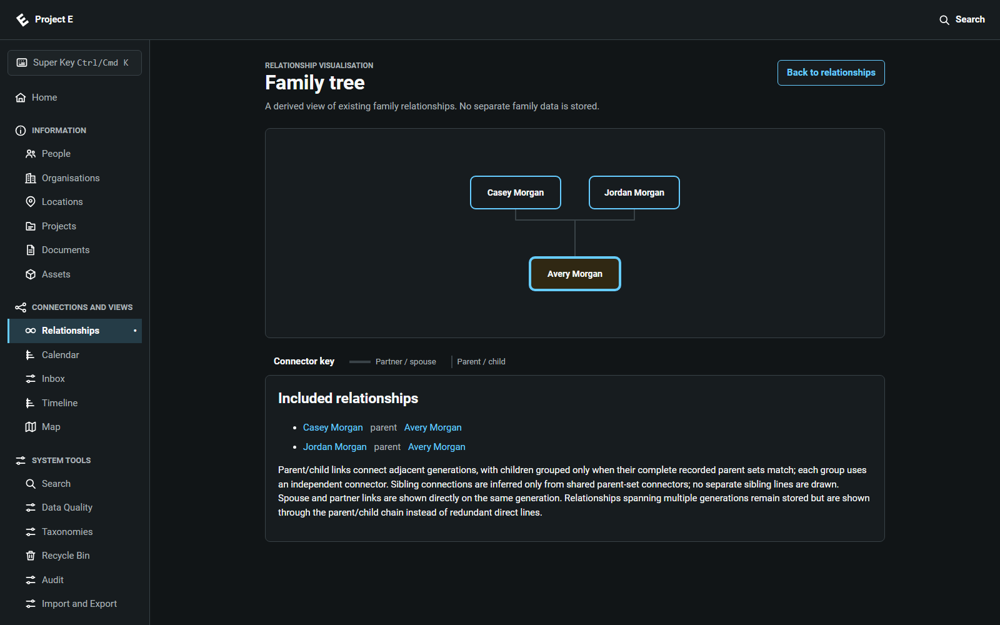
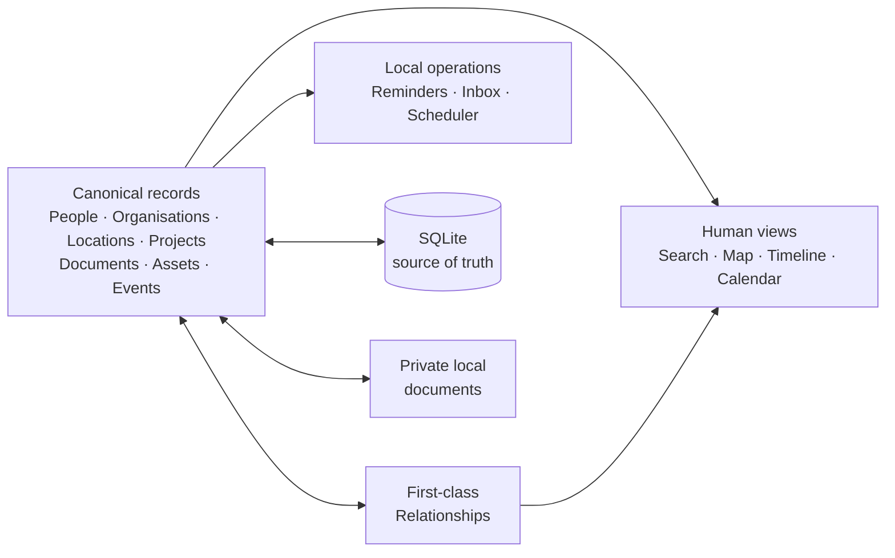

# Project E



<p align="center">
  <strong>A local-first Personal Information Platform for one private user.</strong><br>
  Canonical records, explicit relationships and useful operational views—without a cloud-shaped hole in the middle.
</p>

<p align="center">
  <a href="#the-idea">The idea</a> ·
  <a href="#current-state">Current state</a> ·
  <a href="#see-it">See it</a> ·
  <a href="#run-it">Run it</a> ·
  <a href="#documentation">Documentation</a>
</p>

---

## The idea

Project E keeps People, Organisations, Locations, Projects, Documents, Assets and Events in one connected system. Each real-world object has one canonical record; Search, Map, Timeline, Calendar, Inbox and other workflows are projections over that same information—not rival stores that slowly drift apart.

| **CONNECT** | **OPERATE** | **OWN** |
| --- | --- | --- |
| Model real things once and link them through first-class Relationships. | Turn the same records into search, temporal, geographic and attention workflows. | Keep the database, documents, audit trail, exports and recovery bundles on the local machine. |

The immediate goal is deliberately human: make private information useful, trustworthy and pleasant to work with. Deterministic automation and spatial intelligence build on validation, provenance and explicit control. AI and agents are postponed indefinitely as a primary focus rather than treated as the platform's organising principle.

## Current state

| Track | State | What that means |
| --- | :---: | --- |
| **Phase 1 · Information Platform** | **Complete** | Canonical records and Relationships, Search, Map, Timeline, local Documents, taxonomies, audit/history, data quality, reviewed inference, merging and recovery. |
| **Phase 2 · Operational Time** | **Complete** | Calendar and recurring Events, derived occurrences, reminder policies, durable Inbox delivery, startup recovery, registered scheduled jobs and deterministic automation. |
| **Phase 3 · Spatial Intelligence** | **Planning** | An evolving direction for richer Locations, local spatial data, Map 2.0, journey planning, personal mobility and explainable routing policy. Planning does not authorise implementation. |

Project E currently needs no account and remains useful without WAN access. Optional map tiles and address lookup use replaceable network services; canonical records and core workflows do not.

The earlier experimental Task subsystem was retired on 2026-08-01 because it had no user data and had not proved useful. Any future to-do or work-management capability starts from a newly authorised design rather than compatibility with that implementation.

> [!NOTE]
> This is an active, source-available development project—not a stable release or an open-source distribution. The [Phase 2 workspace](docs/phase_2_workspace.md) records the completed operational-time milestone; the [Phase 3 planning workspace](docs/phase_3_spatial_intelligence_planning.md) records the current direction.

## See it

These screenshots were captured from an isolated database containing fictional demonstration records. Select any image to open it at full size.

| Home | Connected Person |
| :---: | :---: |
| [](docs/assets/screenshots/home.png) | [](docs/assets/screenshots/person-profile.png) |
| **Home.** Open canonical information domains, specialist views, favourites and recent records. | **Person profile.** Read one canonical record in the context of its locations, organisation and family. |

| Calendar | Family Tree |
| :---: | :---: |
| [](docs/assets/screenshots/calendar.png) | [](docs/assets/screenshots/family-tree.png) |
| **Calendar.** Work with local Events through a focused Month, Week or Day projection. | **Family Tree.** Derive a navigable graph from the same first-class Relationships used everywhere else. |

## One source, many views


```mermaid
flowchart LR
    C["Canonical records<br/>People · Organisations · Locations · Projects<br/>Documents · Assets · Events"]
    R["First-class<br/>Relationships"]
    V["Human views<br/>Search · Map · Timeline · Calendar"]
    O["Local operations<br/>Reminders · Inbox · Scheduler"]
    D[("SQLite<br/>source of truth")]
    F["Private local<br/>documents"]

    C <--> R
    C --> V
    R --> V
    C --> O
    C <--> D
    C <--> F
```

Every view and deterministic operation stays traceable to canonical local records. Consequential changes require explicit user control.

## Run it

The runtime is standard-library Python with SQLite and no third-party Python packages.

```bash
python3 run.py
```

Open `http://127.0.0.1:8000`. A fresh clone starts empty and creates its Git-ignored database, document storage and recovery directories beneath `instance/`.

Run the project checks with:

```bash
python3 -m unittest discover -s tests
python3 -m compileall app run.py tests
```

## Built deliberately

- **Local-first and private.** The useful core does not depend on a hosted service or continuous connection.
- **Entity- and relationship-first.** Model each real thing once, then derive coherent views over it.
- **Human usefulness before intelligence.** Dependable everyday workflows come before advanced assistance.
- **Safe, legible change.** Validation, audit history, provenance and confirmation protect consequential writes.
- **Small technical surface.** Standard-library Python, embedded SQLite and conservative dependencies keep the platform understandable.
- **Clean evolution.** While the product is unstable, coherent current architecture wins over compatibility layers for abandoned designs.

## Documentation

| Start here | Go deeper |
| --- | --- |
| [Project goal](PROJECT_GOAL.md) | [Architecture](docs/architecture.md) · [Database design](docs/database_design.md) · [Ontology](docs/ontology.md) |
| [Phase 1 specification](docs/phase_1_spec.md) | [Architecture decisions](ARCHITECTURE_DECISIONS.md) · [Glossary](docs/glossary.md) |
| [Phase 2 workspace](docs/phase_2_workspace.md) · [Phase 3 planning](docs/phase_3_spatial_intelligence_planning.md) | [Experience philosophy](docs/experience_philosophy.md) · [Design system](docs/design/README.md) |
| [Roadmap](ROADMAP.md) · [Future direction](docs/future_direction.md) | [Build history](docs/build_log.md) · [Technical debt](docs/reviews/technical_debt_register.md) |
| [Contributing](CONTRIBUTING.md) · [Agent workflow](AGENTS.md) | [Security policy](SECURITY.md) · [Copyright](COPYRIGHT.md) |

## Portability and recovery

System Tools → Import and Export creates a versioned, checksummed ZIP containing a consistent SQLite snapshot and referenced document files. Import validates and previews the bundle, requires an empty target and creates a recovery backup before confirmed replacement. Confirmed merges and permanent entity deletion also create local recovery bundles.

Recovery is preview-only unless explicitly confirmed:

```bash
python3 tools/restore_backup.py instance/backups/<bundle>.zip
python3 tools/restore_backup.py instance/backups/<bundle>.zip --confirm-replace
```

Private databases, uploaded documents, logs, caches, exports and backups belong under Git-ignored local storage and must never be committed.

---

<p align="center">
  <strong>Project E is source-available, not open source.</strong><br>
  Copyright © 2026 yogurtreceptor. No licence for reuse or redistribution is granted.
</p>
